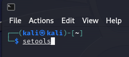
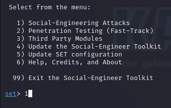
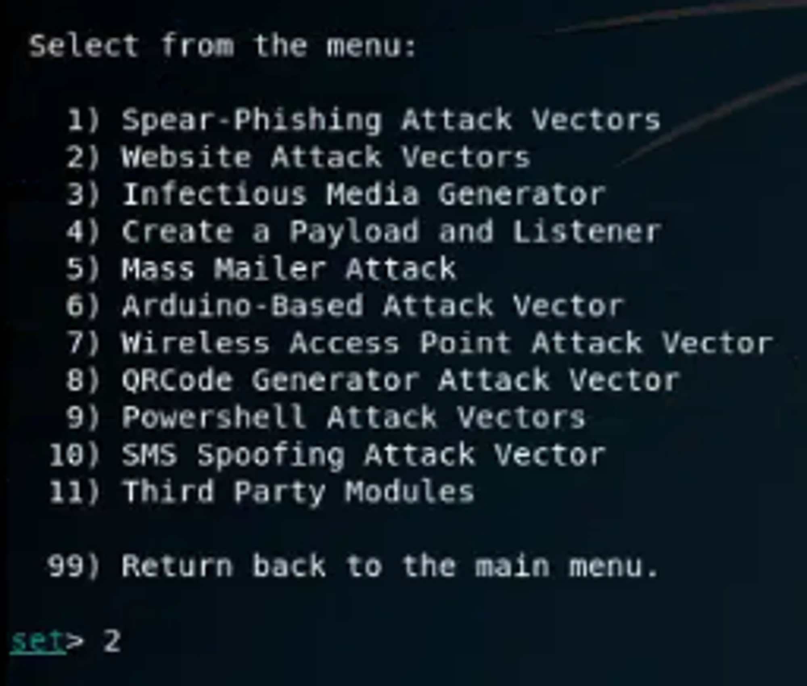
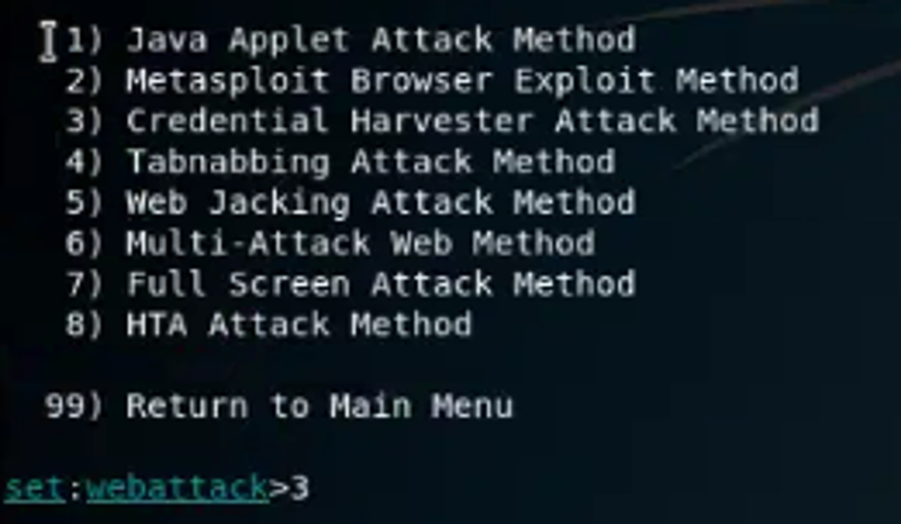
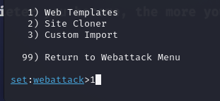
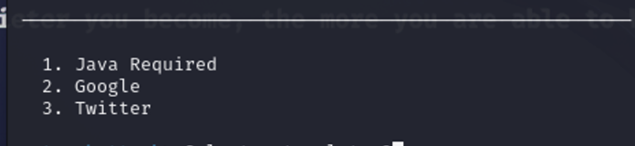
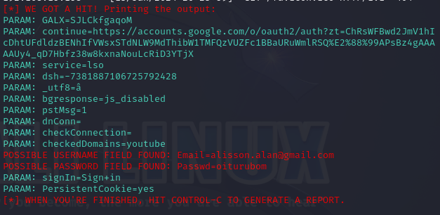

# Meu passo a passo...

- Abri o Kali Linux
- Dei o comando setools:



- A partir do setools fui selecionando os seguintes itens:
  

<div align="left">

</div>

 ```1 - Social-Engineering Attacks ```
 
<div align="left">

</div>

 ```2 - Web Site Attack Vectors ```

 <div align="left">

</div>

 ```3 - Credential Harvester Attack Method ```

 <div align="left">

</div>

  ```2 - Site Cloner ```


- Tentei pelos templates que já tinham e fui no google.
 <div align="left">

</div>

  ```2 - Google ```

### RETORNO!
<div align="left">

</div>

